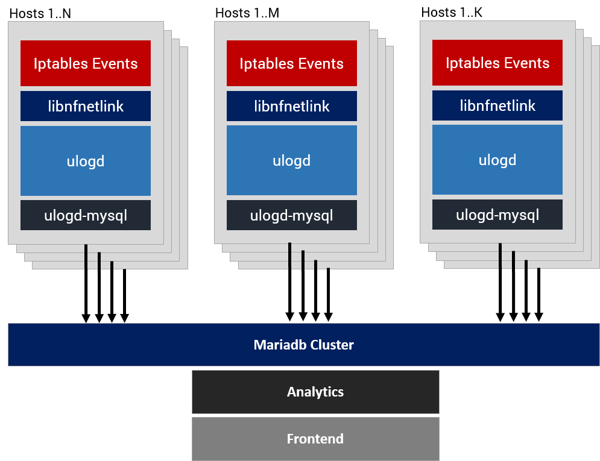

thor-firewall-logger
========================================

firewall event logging via [nflog netlink](https://git.netfilter.org/libnfnetlink/) and [ulogd2](https://www.netfilter.org/projects/ulogd/) userspace daemon

```raw
  _____ _   _  ___  ____       _____ _                        _ _
 |_   _| | | |/ _ \|  _ \     |  ___(_)_ __ _____      ____ _| | |
   | | | |_| | | | | |_) |____| |_  | | '__/ _ \ \ /\ / / _` | | |
   | | |  _  | |_| |  _ <_____|  _| | | | |  __/\ V  V / (_| | | |
   |_| |_| |_|\___/|_| \_\    |_|   |_|_|  \___| \_/\_/ \__,_|_|_|
```

## Features ##

* Efficient SQL Logging Scheme
* **Multi Host** Log Aggregation using dedicated sql-user
* Packet-Logging is splitted using the ip-protocol (tcp, udp, sctp, icmp, icmpv6)
* Interfaces, Remotes, Prefixes and MAC Relation tables are separated
* Inserts Records via Stored-Procedures
* Designed to be used with [mariadb](https://mariadb.org) or [mysql](https://mysql.com)
* Includes Human-Readble Analaytics View
* Created as component of [thor-firewall](https://github.com/AenonDynamics/thor-firewall)

### Multihost Logging Architecture ###



## Requirements ##

* **ulogd v2**
* **mysql/mariadb** server
* **mysql/mariadb** libraries
* **netfilter nflog** support

## Installation ##

For Debian based distributions

```bash
# install ulogd package
apt-get install ulogd2 ulogd2-mysql

# copy ulogd2 config
cp ulogd.conf /etc/ulogd.conf

# add database..
# add dedicated user..

# import sql scheme
mysql -p --database=thor_firewall < packet-logging.sql

# adjust mariadb user account/database
# nano /etc/ulogd.conf

# initialize custom systemd service (restart on error)
cp systemd/ulogd2.service /etc/systemd/system/ulogd2.service
systemctl daemon-reload
systemctl restart ulogd2
```

## Usage ##

The architecture is designed to use a **single netlink group** - events are identified by using a custom `nflog-prefix`

**IPTables Example**

```bash
# create a customm logging group
iptables -t filter -N LOGACCEPT
iptables -t filter -A LOGACCEPT -m limit --limit 2/min -j NFLOG --nflog-group 1 --nflog-prefix LOG-ACCEPT-EVENT --nflog-threshold 20
iptables -t filter -A LOGACCEPT -j ACCEPT

# logging
iptables -t filter -A FORWARD -m conntrack --ctstate NEW -i eth0.1 -o eth0.10 -j LOGACCEPT
```

## Distributions ##

Tested with:

* Debian Jessie 8.7
* Debian Stretch 9.0
* Debian Stretch 9.1
* ulogd v2.0.4

## Todo ##

* Replace **ulogd** with **GO** based netlink->mariadb gateway..

## License ##
**THOR-FIREWALL-LOGGER** is OpenSource and licensed under the Terms of [GNU General Public Licence v2](LICENSE.txt). You're welcome to [contribute](CONTRIBUTE.md)!